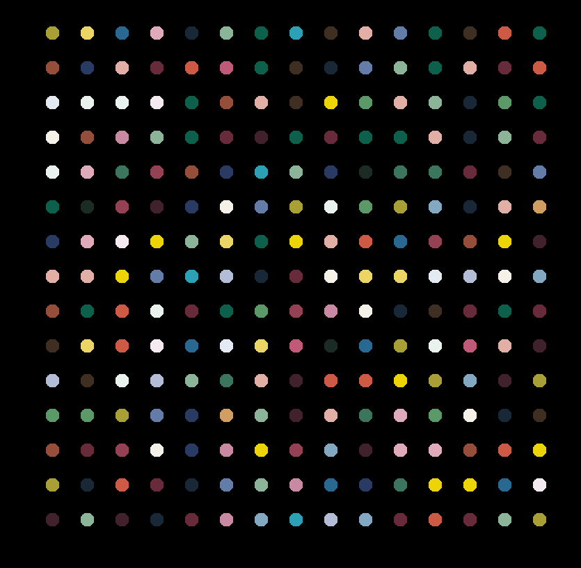

# **Hirst Dot Painting Generator**

This project is a Python script that generates a dot painting inspired by Damien Hirst's artwork. The script extracts colors from an image and uses the `turtle` module to create a randomized dot pattern on the screen.

## **Features**

- **Extracts** a specified number of colors from an image using `colorgram.py`.
- **Generates** a dot painting using `turtle` graphics.
- **Randomly selects** colors from the extracted palette to create a visually appealing artwork.

## **Requirements**

This project requires **Python 3** and the following dependencies:

```sh
colorgram.py==1.2.0
pillow==11.1.0
```

Install them using:

```sh
pip install -r requirements.txt
```

## **How to Run**

1. **Ensure** you have Python installed on your system.
2. **Install** the required dependencies using:
   ```sh
   pip install -r requirements.txt
   ```
3. **Place** an image file (`drawing.jpg`) in the same directory as the script.
4. **Run** the script:
   ```sh
   python script.py
   ```
5. **The script will extract colors** from `drawing.jpg` and generate a dot painting.
6. **Click** on the window to close it when finished.

## **Example Output**


